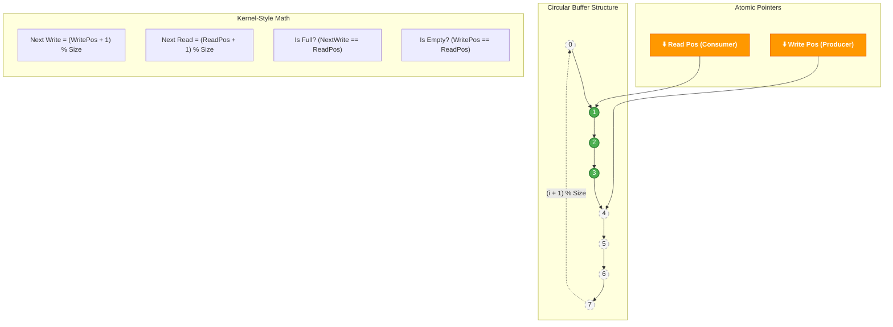

# atomic-dsp-graph
A high-performance C++20 DSP engine that enforces kernel-space constraints (zero-allocation, wait-free) in user-space for deterministic audio processing.

## The "Spotify-Core" Architecture

This project is built upon the engineering principles used by world-class audio players (such as Spotify, Apple Music, and Tidal). While the source code for these systems is proprietary, the physical constraints of digital audio impose a common architecture to prevent **Buffer Underruns** (audio glitches/stuttering).

Here is how the **"Kernel-Style C++"** concepts applied in this project solve real-world problems:

### 1. The Golden Rule: Thread Separation

The internal architecture splits the application into two distinct worlds:

* **Non-Real-Time Threads (The "Slow Path"):**
    * **Responsibilities:** Downloading, disk access, UI updates, and file decoding (e.g., OGG/MP3 to PCM).
    * **Permissions:** Allowed to use `std::mutex`, `malloc`, and blocking operations (I/O).
* **Real-Time Audio Thread (The "Critical Path"):**
    * **Responsibilities:** Feeding the sound hardware.
    * **Loop Cycle:** Runs every ~2ms to ~10ms.
    * **Constraint:** **Forbidden to block.** If the CPU stalls here, the audio glitches.

### 2. The Heart of the System: Lock-Free Ring Buffer

The main challenge is passing data from the "Slow Path" to the "Critical Path" without locking. To achieve this, we utilize **Lock-Free Circular Buffers**.

* **Producer:** The decoding thread fills the buffer.
* **Consumer:** The audio thread reads and processes it.
* **The Magic:** We use **Atomic Operations** (`std::atomic` in C++) to manage read/write pointers.
* **The Result:** The audio thread *never* waits for a `mutex`. If the buffer runs empty, it plays silence, but the system never hangs.

### 3. Memory Management (Memory Pooling)

Spotify cannot call `new` or `delete` during playback because Heap allocation is non-deterministic (the OS might take time to find a free block) and causes memory fragmentation.

* **Our Solution:** Implementation of **Custom Allocators (Memory Arenas)**. All memory required for the processing graph is pre-allocated at initialization. During playback, we essentially reuse existing memory addresses.

### 4. Static Polymorphism (Template Metaprogramming)

To apply effects (EQ, Volume, Fades) with maximum efficiency, we avoid the cost of **Virtual Functions**. At 44.1kHz, looking up a function in the *vtable* for every single sample is expensive.

* **Technique:** We use **Templates and CRTP** (Curiously Recurring Template Pattern) to configure the processing chain at *compile-time*, allowing the compiler to perform aggressive **inlining**.

---

### Project Architecture Summary

We simulate this high-performance flow:

1.  **Main Thread:** Loads from Disk $\rightarrow$ Decodes $\rightarrow$ Writes to Ring Buffer.
2.  **Audio Engine (Simulated):** Reads from Ring Buffer $\rightarrow$ Processes (Volume/EQ without `virtual`) $\rightarrow$ Output.
3.  **Constraints:** Strict enforcement of *Zero-Allocation* and *Wait-Free* logic on the consumption thread.
